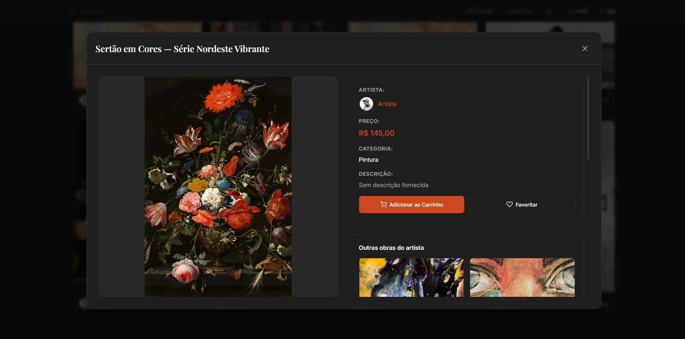
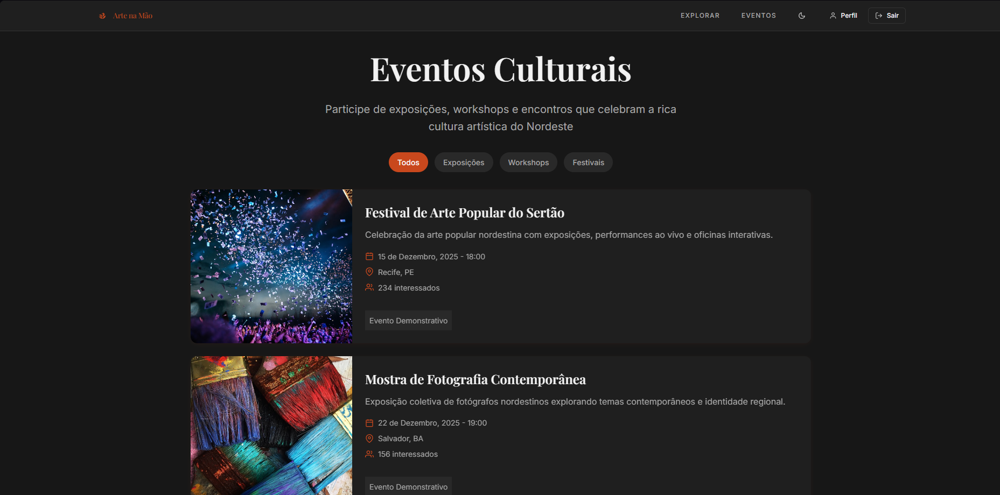
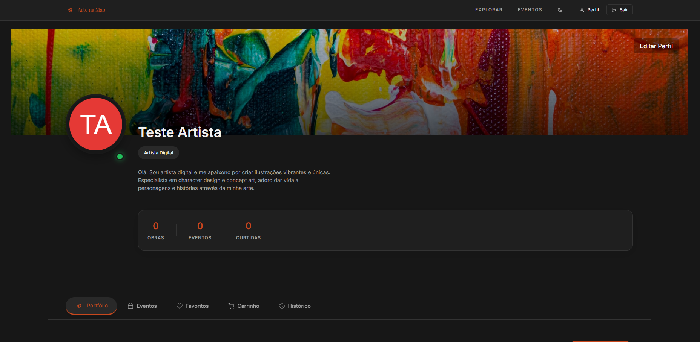

# 🎨 Arte Na Mão - Frontend

[](https://github.com/WyldSLA/arte-na-mao)
[](LICENSE)

## ✍ Introdução

O **Arte Na Mão** é uma plataforma de e-commerce dedicada a valorizar e promover o talento de artistas nordestinos, conectando criadores de arte com apreciadores e colecionadores de todo o Brasil.

Nosso objetivo é facilitar a divulgação e venda de obras de arte, produtos artesanais e trabalhos exclusivos produzidos por artistas do Nordeste, além de promover eventos artísticos e culturais da região, fortalecendo a economia criativa local e dando visibilidade à rica produção cultural nordestina.

## ✨ Funcionalidades

O frontend oferece as seguintes interfaces e funcionalidades:

### Para Artistas
* **Tela de Cadastro de Artista:** Formulário completo para registro e criação de perfil profissional
* **Painel de Gerenciamento:** Interface para upload e organização de obras de arte
* **Criação de Eventos:** Formulários para divulgação de eventos artísticos e culturais
* **Dashboard do Artista:** Visualização de vendas e engajamento

### Para Clientes
* **Catálogo de Obras:** Interface de navegação com filtros por categorias artísticas (Pintura, Escultura, Artesanato, Fotografia, etc.)
* **Sistema de Favoritos:** Funcionalidade para salvar obras e artistas preferidos
* **Carrinho de Compras:** Interface completa do processo de compra
* **Galeria de Eventos:** Visualização e inscrição em eventos artísticos
* **Perfil de Usuário:** Telas para gerenciamento de dados pessoais, histórico de compras e favoritos

### Páginas Principais
* **Página Inicial (Landing):** Destaques de obras, artistas em evidência e eventos próximos
* **Detalhes da Obra:** Visualização completa do produto com galeria de imagens e informações do artista
* **Página do Artista:** Biografia, portfólio e obras disponíveis
* **Busca e Filtros:** Interface de pesquisa com múltiplos critérios
* **Checkout:** Fluxo de finalização de compra

## 💻 Tecnologias Utilizadas

Este projeto frontend foi desenvolvido utilizando:

| Categoria | Tecnologia | Descrição |
| :--- | :--- | :--- |
| **Marcação** | HTML5 | Estrutura semântica das páginas |
| **Estilização** | CSS3 | Design responsivo e animações |
| **Interatividade** | JavaScript (ES6+) | Lógica e interações do cliente |
| **Controle de Versão** | Git | Versionamento de código |


## 📸 Capturas de Tela e Demonstração

### Página Inicial (Home)
*Vitrine com obras em destaque e artistas nordestinos*


### Catálogo de Produtos
*Explore a diversidade da arte nordestina*


### Visualização do Produto
*Detalhes completos da obra e informações do artista*



### Catálogo de Eventos
*Descubra e participe de eventos artísticos*



### Perfil de Usuário
*Gerencie suas compras, favoritos e participação em eventos*



## ⚙ Como Começar

Para rodar o frontend localmente, siga os passos abaixo:

### Pré-requisitos

Certifique-se de ter instalado:
- Um navegador web moderno (Chrome, Firefox, Edge, Safari)
- Um editor de código (VS Code, Sublime Text, etc.)
- Git

### Instalação e Execução

1. Clone o repositório:
```bash
git clone https://github.com/WyldSLA/arte-na-mao.git
cd arte-na-mao
```

2. Abra o projeto no seu editor preferido:
```bash
code .
```

3. Execute o projeto:
   - Opção 1: Abra o arquivo `index.html` diretamente no navegador
   - Opção 2: Use a extensão Live Server do VS Code
   - Opção 3: Use um servidor local simples:

4. Acesse no navegador:
```
http://localhost:8000
```

## 🎯 Estrutura do Projeto

```
arte-na-mao/
├── images/                      # Imagens e recursos visuais
├── public/                      # Arquivos públicos
│   └── assets/
│       ├── css/                # Folhas de estilo
│       ├── js/                 # Scripts JavaScript
│       └── midia/              # Arquivos de mídia
├── src/                        # Código fonte principal
│   ├── components/             # Componentes reutilizáveis CSS
│   │   ├── artcard.css        # Card de obra de arte
│   │   ├── buttons.css        # Botões do sistema
│   │   ├── dashboard.css      # Dashboard comum
│   │   ├── modal-artwork.css  # Modal de visualização de obra
│   │   ├── navbar.css         # Barra de navegação
│   │   └── profileCard.css    # Card de perfil
│   └── pages/                  # Páginas da aplicação
│       ├── dashboard-artista/  # Painel do artista
│       │   ├── assets/
│       │   ├── dashboard-artista.js
│       │   ├── index.html
│       │   ├── script.js
│       │   └── style.css
│       ├── dashboard-cliente/  # Painel do cliente
│       │   ├── index.html
│       │   ├── script.js
│       │   └── style.css
│       ├── eventos/            # Página de eventos
│       │   ├── index.html
│       │   ├── script.js
│       │   └── style.css
│       └── explorar/           # Página de exploração
│           ├── index.html
│           ├── script.js
│           └── style.css
├── index.html                  # Página inicial
├── login.html                  # Página de login
├── register.html               # Página de cadastro
├── .gitignore
├── LICENSE
├── package-lock.json
└── README.md
```

## 🤝 Contribuição

Contribuições são bem-vindas! Se você tiver sugestões, relatar um bug ou quiser adicionar novos recursos, siga o processo de [fork e pull request](https://docs.github.com/pt/pull-requests/collaborating-with-pull-requests/proposing-changes-with-pull-requests/creating-a-pull-request-from-a-fork).

### Como Contribuir
1. Faça um fork do projeto
2. Crie uma branch para sua feature (`git checkout -b feature/NovaInterface`)
3. Commit suas mudanças (`git commit -m 'Adiciona nova interface'`)
4. Push para a branch (`git push origin feature/NovaInterface`)
5. Abra um Pull Request

### Boas Práticas
- Mantenha o código semântico e acessível
- Teste em múltiplos navegadores
- Garanta responsividade mobile
- Comente código complexo
- Siga os padrões de nomenclatura do projeto

## 📄 Licença

Este projeto está sob a licença [MIT](LICENSE).

---

## 🗺 Roadmap do Projeto Arte Na Mão - Frontend

Este documento descreve os planos de desenvolvimento da interface do projeto.

**Legenda de Status:**
- ✅ Concluído
- ⏳ Em Andamento
- 📋 A Fazer
- 💡 Ideia Futura

## Fase 1: MVP - Interface Básica

Estrutura essencial das páginas principais.

### Páginas
* ✅ Página Inicial (Home) com layout básico
* ✅ Catálogo de Obras
* ⏳ Página de Detalhes da Obra
* ⏳ Catálogo de Eventos
* ⏳ Perfil de Usuário

### Funcionalidades
* ✅ Navegação entre páginas
* ⏳ Formulários de cadastro/login
* 📋 Sistema de favoritos (interface)
* 📋 Carrinho de compras (interface)
* 📋 Responsividade completa

---

## Fase 2: Interatividade e UX

Melhorias na experiência do usuário.

### Funcionalidades
* 📋 Filtros dinâmicos no catálogo
* 📋 Busca em tempo real
* 📋 Galeria de imagens nas obras
* 📋 Animações e transições suaves
* 📋 Formulário de checkout completo
* 📋 Sistema de inscrição em eventos
* 📋 Validação de formulários
* 💡 Preview de imagens antes do upload

---

## Fase 3: Recursos Avançados

Funcionalidades que enriquecem a plataforma.

### Funcionalidades
* 💡 Modo escuro/claro
* 💡 Filtros avançados com múltiplos critérios
* 💡 Carousel de obras em destaque
* 💡 Sistema de avaliações (estrelas)
* 💡 Chat/Mensagens (interface)
* 💡 Compartilhamento em redes sociais
* 💡 Notificações visuais
* 💡 Tour guiado para novos usuários

---

## Fase 4: Otimização e Performance

Foco em velocidade e acessibilidade.

### Funcionalidades
* 💡 Lazy loading de imagens
* 💡 Otimização de assets
* 💡 PWA (Progressive Web App)
* 💡 Acessibilidade WCAG nível AA
* 💡 Suporte offline básico
* 💡 Animações com GPU acceleration
* 💡 Minificação de CSS/JS

---

## 🌟 Visão de Longo Prazo

Criar uma interface moderna, acessível e envolvente que represente a riqueza da arte nordestina, proporcionando uma experiência única tanto para artistas quanto para apreciadores de arte.
